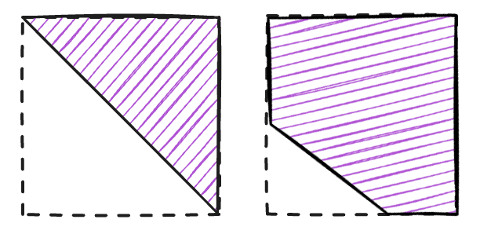

# Ring Attention with Sliding Window

This document outlines an implementation of ring attention tailored for the sliding window attention mechanism, supporting both standard (non-varlen) and variable-length (varlen).

-----

## 🧠 Analysis

### Sequence Splitting

In a sliding window attention mechanism, most queries compute attention over the same number of key-value (KV) pairs. This balanced computational load makes it well-suited for a simple ring communication strategy. The input sequence is split evenly across the context parallel size (`cp_size`), so each rank holds a contiguous block of queries, keys, and values.

As illustrated above, the number of KV blocks each rank must process depends on the `cp_size`, the window size ($W$), and the sequence length per rank ($M$).

Each rank computes attention against its local KV block plus several blocks from preceding ranks. The number of blocks a rank needs to compute on is $\lceil W/M \rceil + 1$. This requires $C$ rounds of communication, where:

$$C = \min(\lceil W/M \rceil, \text{cp size} - 1)$$

The number of communication rounds is capped at `cp_size` - 1 because a query only needs to interact with a maximum of `cp_size` - 1 other KV blocks.

### Mask Patterns

When considering the interaction between a query block and a key-value block, we encounter four distinct mask patterns. These can all be efficiently implemented by adjusting the `window_size` and `causal` parameters in `flash_attn`.

<table>
  <tr>
    <td valign="center" width="250">
      
    </td>
    <td valign="top">
      
<b>Diagonal Blocks</b>: This is the standard sliding window attention case, handled by <b>flash_attn</b> by setting the <code>window_size</code> parameter.

    </td>
  </tr>
  <tr>
    <td valign="center" width="250">
      
    </td>
    <td valign="top">
      
<b>Full Blocks</b>: Requires a full attention computation, which is the default behavior of <b>flash_attn</b>.

    </td>
  </tr>
  <tr>
    <td valign="center" width="250">
      
    </td>
    <td valign="top">
      
<b>Lower-Left Masked Blocks</b>: Skips the lower-left triangle. This is achieved in <b>flash_attn</b> by setting <code>window_size=(k, -1)</code> where <code>k > 0</code>.

    </td>
  </tr>
  <tr>
    <td valign="center" width="250">
      
    </td>
    <td valign="top">
      
<b>Upper-Right Only Blocks</b>: Computes only the upper-right corner. This is handled with <b>flash_attn</b> by setting <code>window_size=(0, -1)</code>.

    </td>
  </tr>
</table>

### Attention Result Merging

For each rank, the results from multiple attention calculations must be merged to produce the final output. To fuse the results of two attention computations, we use their respective outputs ($o_1, o_2$) and LogSumExp (LSE) statistics ($l_1, l_2$), which are maintained for each query.

Given the partial outputs $o_1$ and $o_2$ with their corresponding LSE values $l_1$ and $l_2$, the new merged output $o_{new}$ and LSE $l_{new}$ are calculated as:

$$l_{new} = \log(\exp(l_1) + \exp(l_2))$$

$$o_{new} = \frac{o_1 \cdot \exp(l_1) + o_2 \cdot \exp(l_2)}{\exp(l_1) + \exp(l_2)}$$

This formula can be applied iteratively to update the attention output and LSE, yielding the final result needed for the backward pass. 

-----

## ⚙️ Non-Varlen Implementation

### Forward Pass

At the beginning of the forward pass, each rank receives its corresponding query, key, and value block. Our computational strategy involves each rank sending its key-value (KV) block to the next rank in the ring.

Using a context parallel size (`cp_size`) of 5 and $C$ communication rounds as an example, the process is as follows:

  * **Step 0**: Compute the diagonal attention (the local block) and initialize the attention output and softmax LSE tensors. Simultaneously, send the local KV block to the next rank.
  * **Step 1 to C-1**: Receive a KV block from the previous rank, determine the appropriate mask type, and perform the attention calculation. After the calculation, update the rank's attention output and softmax LSE, and then pass the received KV block to the next rank.
  * **Step C**: In the final step, after receiving a KV block, perform the last attention calculation and update. No further KV blocks are sent. The final result is saved for the backward pass.

Throughout this process, the computational load is mostly balanced, although the first $C$ ranks will have some idle time.

### Backward Pass

For the backward pass, each rank receives the gradient of its attention output and initializes the corresponding Q, K, and V gradient tensors.

The direction of computation and communication in the backward pass is the reverse of the forward pass.

Each rank keeps its original query, attention output, and output gradient in GPU memory. The KV blocks are passed to the previous rank in the ring. At each step, gradients with respect to the query ($dq$), key ($dk$), and value ($dv$) are computed. The $dq$ is accumulated locally, while the $dk$ and $dv$ corresponding to the received KV block are passed to the previous rank.

After $C+1$ computation steps and $C$ communication rounds, each rank will have the complete gradients $dq, dk, dv$ for its original QKV block. The backward pass is then complete.

-----

## 🧬 Varlen Implementation

The principles for the varlen implementation are similar to the non-varlen version; however, it requires special handling of attention masks because multiple sequences of varying lengths are packed together. 

In standard varlen attention, the mask consists of multiple block-diagonal matrices. Applying a sliding window results in a banded block-diagonal mask.

With varlen, sequence interactions are primarily handled in the diagonal block, which requires a `flash_attn_varlen_func` call.

Off-diagonal blocks represent the interaction between a rank's queries and the keys/values from other ranks. The computation for these blocks simplifies into two primary patterns:

(1) Rectangular Attention: At its core, an off-diagonal computation is an attention operation between two contiguous blocks of tokens. This forms a standard rectangular attention region.

(2) Applying Sliding Window: When the sliding window is applied, a triangular section in the lower-left of this rectangle is masked out, as those key positions fall outside the window.

Therefore, for off-diagonal blocks, the main task is to precisely define the boundaries of this valid attention region and translate them into the correct window_size parameters for a standard non-varlen flash_attn call.

These parameters depend only on the first sequence starting within the current rank's block. This is because any interaction with an off-diagonal block implies that the query sequence began before the current block.

Therefore, for the varlen implementation, each rank requires the following additional information:

  * The `cu_seqlens` relative to the current rank's data, for computing the diagonal block.
  * The length of the first sequence within the current rank, for computing off-diagonal blocks.

The number of communication rounds remains $C = \min(\lceil W/M \rceil, \text{cp size}-1)$.

### Forward Pass

The forward pass is fundamentally the same as the non-varlen version. The diagonal part is very simple, just call `flash_attn_varlen_func`; the non-diagonal part, based on the current rank and cu_seqlens information, determine the part that needs to be calculated, and call `flash_attn_func` to calculate.

There is a special case must be handled: when the query length is greater than the key length, a direct call to `flash_attn_func` can lead to errors. To resolve this, we split the computation into two parts: a full attention segment and a sliding window attention segment where the query and key lengths are equal.

### Backward Pass

The backward pass is similar to the non-varlen implementation. It also requires special handling for the case where the query length exceeds the key length.

---

## 💬 Conclusion

Thanks for checking out this implementation! Further discussions, questions, and contributions are highly welcome. Please feel free to open an issue or submit a pull request.
